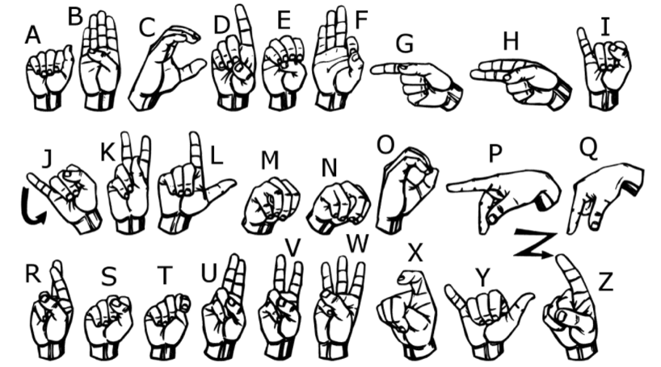
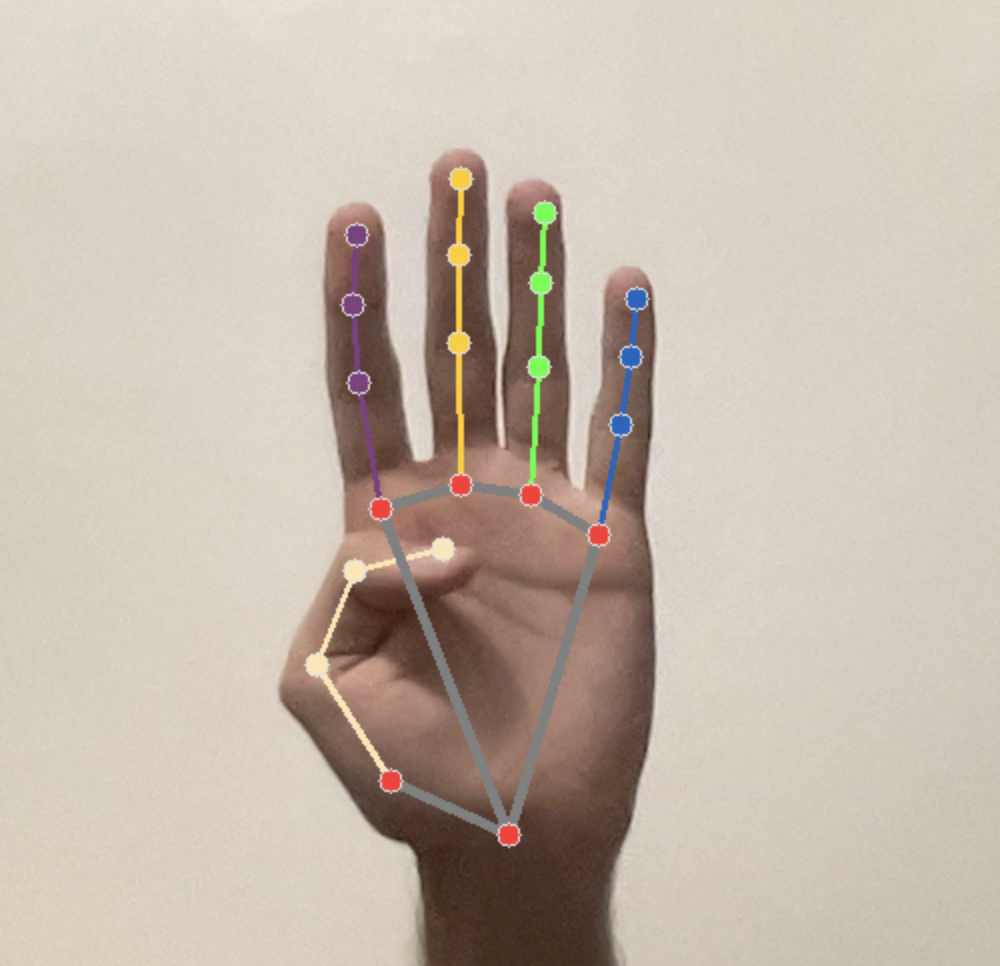
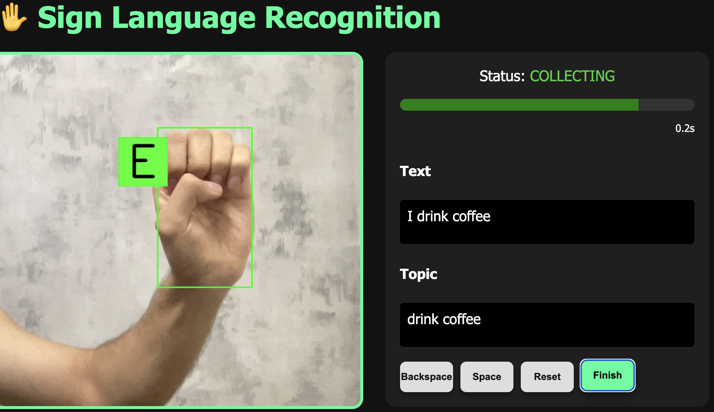

# ✋ Real-Time American Sign Language (ASL) Recognition System

## 📌 Overview

This project presents a **real-time American Sign Language (ASL) alphabet recognition system** that integrates **Computer Vision, Machine Learning, and Natural Language Processing (NLP)** into a unified and efficient pipeline. The system is designed to recognize static ASL hand gestures captured via webcam and convert them into meaningful textual output in real time.

The core idea of this project is to build a **lightweight yet highly accurate recognition system** that can run efficiently on CPU-based devices without requiring GPU acceleration. The system achieves this by combining **MediaPipe hand landmark detection**, **feature engineering**, and a **Support Vector Machine (SVM)** classifier optimized through Bayesian hyperparameter tuning.

In addition to gesture recognition, a **post-processing NLP layer** is integrated to improve the readability and usability of the generated text using spell correction and semantic keyword extraction.

---

## 🎯 Objectives

The main objectives of this project are:

- To design a real-time system for recognizing static ASL alphabets
- To extract robust hand features using MediaPipe landmarks
- To train a classical machine learning model (SVM) for classification
- To achieve high accuracy with low computational cost
- To enhance output usability using NLP-based post-processing
- To build an end-to-end deployable interactive system

---

## 🧠 System Architecture

The pipeline of the system consists of the following stages:

1. **Video Capture (Webcam Input)**
2. **Hand Detection using MediaPipe**
3. **Landmark Extraction (21 Key Points)**
4. **Feature Engineering**
   - Finger joint angles
   - Distances from wrist to key joints
5. **Data Preprocessing**
   - Feature scaling (Standardization)
6. **Classification**
   - Support Vector Machine (SVM with RBF kernel)
   - Bayesian hyperparameter optimization
7. **Post-processing Layer**
   - Spell correction (edit distance)
   - Keyword extraction (KeyBERT)
8. **Final Text Output & UI Display**

---

## 📊 Dataset

- Total samples: **34,000+**
- Classes: **24 static ASL alphabet gestures**
- Data source: Webcam-based self-collected dataset
- Variations included:
  - Hand rotation
  - Scale changes
  - Different viewing angles
  - Environmental variation

The dataset was split into:

- **80% training set**
- **20% testing set**

All features were standardized before training to ensure numerical stability and optimal model performance.

  

---

## 🔍 Feature Extraction

Each hand frame is processed using MediaPipe to extract **21 landmark points**. From these landmarks, the following features are derived:

- Relative distances between key points
- Angles between fingers
- Spatial relationships between joints and wrist
- Normalized geometric descriptors

These handcrafted features significantly improve the performance of the classical ML model compared to raw coordinates.

  

---

## 🤖 Machine Learning Model

### Support Vector Machine (SVM)

- Kernel: **RBF (Radial Basis Function)**
- Optimizer: **Bayesian Hyperparameter Optimization**
- Strength: Effective in high-dimensional feature spaces
- Advantage: Lightweight and fast inference

### Performance Metrics

- **Accuracy:** 99.19%
- High precision and recall across all classes
- Stable performance under varying hand positions

---

## ⚡ Real-Time Performance

The system is optimized for real-time execution:

- Average FPS: **~33 frames per second**
- Latency: **~30 ms per frame**
- Runs efficiently on **CPU-only systems (MacBook Pro M1 tested)**

This makes the system suitable for deployment without requiring GPU hardware.

---

## 🧾 NLP Post-Processing Module

To improve the usability of the generated text, a post-processing layer is applied:

### 1. Spell Correction
- Based on **edit distance algorithms**
- Corrects minor prediction inconsistencies
- Ensures cleaner word formation

### 2. Keyword Extraction (KeyBERT)
- Uses **embedding-based semantic representation**
- Extracts meaningful keywords from generated sentences
- Enhances interpretability of output text

---

## 🖥️ Web Interface

A lightweight web-based interface is developed to demonstrate the system:

- Live webcam feed processing
- Real-time character prediction
- Interactive word and sentence builder
- Buttons for controlling input stream
- Displays processed text output dynamically

The interface ensures an intuitive user experience for real-world testing.

  

---

## 📈 Results

The proposed system achieves:

- High classification accuracy (**99.19%**)
- Robust performance across multiple hand variations
- Real-time inference capability
- Low computational overhead

Overall, the system demonstrates that classical machine learning combined with strong feature engineering can compete with deep learning approaches in constrained real-time environments.

---

## ⚠️ Limitations

- Currently supports only **static ASL alphabets**
- Does not handle dynamic gestures or continuous signing
- Performance may degrade under severe occlusion or extreme lighting conditions

---

## 🚀 Future Work

Future improvements include:

- Extending system to **dynamic gesture recognition**
- Using sequence models (LSTM / Transformers)
- Improving robustness under real-world environments
- Mobile and embedded system deployment
- Multilingual sign language support

---

## 🛠️ Technologies Used

- Python
- OpenCV
- MediaPipe
- Scikit-learn
- NumPy / Pandas
- KeyBERT
- Flask (Web Interface)

---

## 👨‍💻 Authors

- Mohammadparsa Tavasoli  
- Kivan Borna  
Kharazmi University, Tehran, Iran  

---

## 📜 License

This project is developed for **academic and research purposes**.  
Commercial use is not permitted without permission.

---
